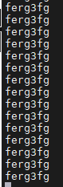
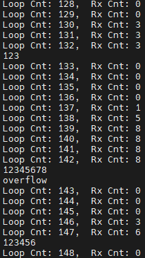

# STM32F429 uart demo
## Build:
1. $make

## Flash:
1. Open STM32 ST-LINK Utility.exe
2. Choose file to flash. 
    - "File -> Open File...", select main.hex
3. Connect to MCU.(need plug USB first)
    - "Target -> Connect"
4. Flash image to MCU.
    - "Target -> Program..."

## Wire connect:
| TTL pin | MCU pin |
|---------|---------|
|   RX    |   PD5   |
|   TX    |   PD6   |
|   GND   |   GND   |

## Uart protocol:
- Bard rate: 921600
- Data bit: 8
- Stop bit: 1
- Parity: None

## Uart rx demo:
Show the specific word.

## Uart interrupt demo:
Loop counter: 500 ms/per

Rx counter: counter input characters, max (8 char)

